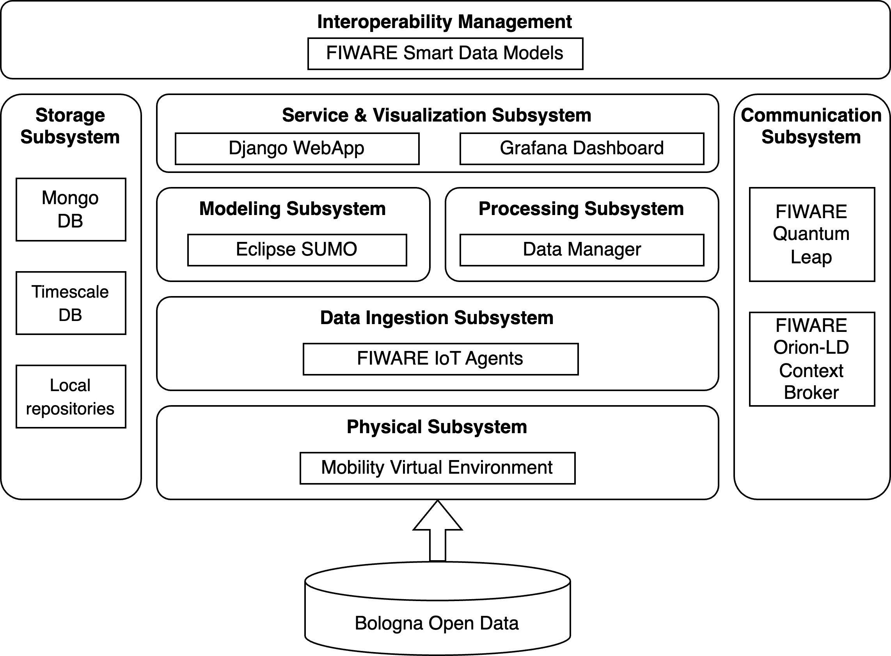

# DIGITAL TWIN OF BOLOGNA: PROTOTYPE OF CN1-HPC-WP2 

BoMoDT is the **Mobility Digital Twin (MoDT)** platform specifically developed for the city of **Bologna (Bo)**, 
serving as an exemplary prototype that implements the CN1-HPC-WP2 Digital Twin reference architecture. 
BoMoDT is designed to deliver real-time monitoring, simulations, and optimization of the city's urban mobility 
infrastructure.

---

## **Table of Contents**

- [Overview](#overview)
  - [Platform Capabilities](#platform-capabilities)
- [High-Level Architecture](#high-level-architecture)
- [References](#references)

---

## **Overview**

BoMoDT integrates traffic flow data streams from [**Bologna Open Data**](https://opendata.comune.bologna.it/) to 
create a dynamic and fidelity virtual representation of the city. The source code, the instruction for deploying the 
platform and execute the different use cases is available in 
[**BoMoDT code repository**](https://github.com/alessandrasomma28/BoMoDT). 

### **Platform Capabilities**

- **Digital Representation and State Simulation:** Accurately models both the structural and behavioral aspects of 
  Bologna’s mobility infrastructure while simulating various traffic scenarios. BoMoDT utilizes the Eclipse SUMO tool 
  for comprehensive traffic modeling and  
  simulation.

- **Bidirectional Synchronization:** Facilitates seamless data flow between physical sensors and the Digital Twin 
  while allowing feedback from the Digital Twin to control real-world traffic light systems. BoMoDT employs FIWARE 
  Generic Enablers (GEs) to manage data exchange and ensure semantic interoperability between the physical 
  infrastructure and its Digital Twin.

- **Traffic Monitoring and Visualization:** 
  - A **Django WebApp** and a **Grafana dashboard** are used to:
    - *(i)* Monitor the status of context entities modeled using FIWARE Smart Data Models.
    - *(ii)* Track real-time traffic flow patterns via the Grafana Dashboard.
    - *(iii)* Visualize simulation outcomes after scenario completion.
  

---
## **High-Level Architecture**

The high-level architecture of BoMoDT follows the design  defined by the **Digital Twin Reference Architecture** 
This architecture specifies the core building blocks and subsystems required for a fully operational Digital Twin. 
The domain independent and platform agnostic architecture, available in [**DTReferenceArchitecture repository**](https://github.com/CN1-HPC-UNINA/DTReferenceArchitecture), has been customized for the urban mobility scenario, 
considering two enabling technologies: 
- [**Eclipse Simulator of Urban MObility**](https://eclipse.dev/sumo/) (SUMO), an open-source, multi-modal, highly 
  portable traffic simulator, designed for simulating real-world traffic scenario.
- [**FIWARE**](https://www.fiware.org/), an open-source and standard based initiative that facilitates the development of smart solutions 
  such as Digital Twins.

  
  
<b>Figure 1:</b> BoMoDT Architecture with respect to CN1-HPC-WP2. 

The architecture shown in Fig. 1 is structured recalling the subsystem names of CN1-HPC-WP2 architecture. More in 
detail, 

- **Physical Subsystem:** this subsystem represents the actual city environment through a **Mobility Virtual 
  Environment** that emulates real-world conditions using real data from **Bologna Open Data**. This is done because 
  *access* to the real infrastructure of Bologna city is *not available*.
- **Data Ingestion Subsystem:** this subsystem utilizes **FIWARE IoT Agents** to aggregate real-time data from physical 
  sensors and devices deployed across the city. The IoT Agent acts as an adapter of device protocol-specific data 
  into a Next Generation Service Interface (NGSI), version Linked Data (LD) format, to ensure data interoperability. 
  The IoT Agent triggers the Context Broker (in the comm. subsystem) to update context entities with the last state.
- **Communication Subsystem:** Ensures smooth data exchange between components using:
  - **FIWARE Orion-LD Context Broker:** This broker is responsible for context data management and 
    subscription-based communication. The context broker stores only the last state (i.e., the ultimate attribute 
    values of context entities).
  - **FIWARE QuantumLeap:** QuantumLeap is subscribed to FIWARE Orion-LD to retrieve each state' change and store 
    historical data.
- **Storage Subsystem:** Responsible for managing data repositories, including:
  - **MongoDB:** For managing structured data.
  - **TimescaleDB:** For time-series data.
  - **Local Repositories:** For other locally stored data resources.
- **Modeling Subsystem:** this subsystem is powered by **Eclipse SUMO**, providing traffic modeling and simulation 
  capabilities. Data to feed simulation are retrieved from Timescale DB.
- **Service & Visualization Subsystem:** this subsystem includes components for data monitoring and visualization:
  - **Django WebApp:** For interacting with context data and managing system operations.
  - **Grafana Dashboard:** For real-time visualization of traffic flows and simulation outcomes.
- **Interoperability Management:** this level utilizes **FIWARE Smart Data Models**, and in particular FIWARE 
  Transportation data models to ensure semantic interoperability, enabling seamless communication between various subsystems.

---

## **References**
For further details, please refer to [**BoMoDT code repository**](https://github.com/alessandrasomma28/BoMoDT). 

  

